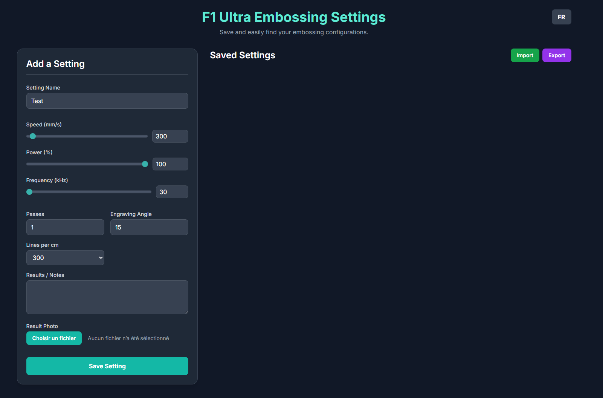

# F1 Ultra Embossing Settings
This application was made using Gemini Canvas and reviewed by @usini.

Save and manage settings for your F1 Ultra laser engraver. This tool helps you keep track of your embossing configurations, so you can easily reuse them.

[**Go to the application**](https://usini.github.io/f1ultra-emboss/)

## Features

- **Save Your Settings**: Store all your important parameters for each project:
  - Speed (mm/s)
  - Power (%)
  - Frequency (kHz)
  - Passes
  - Engraving Angle
  - Lines per cm
- **Add Details**: Give a name to each setting, add notes about the results, and even upload a photo of the final product for a visual reference.
- **Local Storage**: All your settings are saved directly in your browser's local storage. No need for an account.
- **Import/Export**: Easily back up your settings by exporting them to a JSON file. You can also import settings from a file, which is great for sharing or moving between devices.
- **Bilingual**: The interface is available in both English and French.
- **Responsive Design**: Use it on your desktop or mobile device.

## How to Use

1.  **Open the app**: Navigate to the [application URL](https://usini.github.io/f1ultra-emboss/).
2.  **Add a setting**: Fill out the form on the left with your desired parameters.
3.  **Save**: Click "Save Setting". It will appear in the "Saved Settings" list.
4.  **Manage**: You can view, edit, or delete any saved setting. Click on a card to see more details, including the photo.
5.  **Backup**: Use the "Export" button to save all your settings to a file. Use "Import" to load them back.

## Tech Stack

This is a simple front-end application built with:
- HTML
- [Tailwind CSS](https://tailwindcss.com/)
- Vanilla JavaScript
